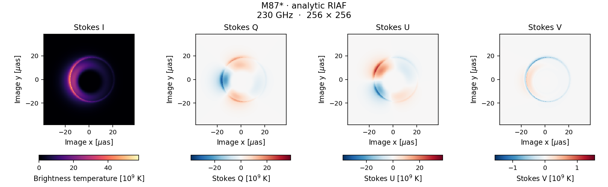

# KPolaris

**Polarized black-hole imaging on CPUs and GPUs.**

KPolaris solves general-relativistic radiative transfer to produce Stokes
I/Q/U/V images from analytic plasma models and GRMHD simulations. Kokkos provides
portable parallel execution from a shared numerical implementation.

[User guide](docs/README.md) · [Wiki](https://github.com/zelinzh/KPolaris/wiki) · [Plotting](docs/plotting.md) · [Code structure](docs/architecture.md) · [中文说明](README_zh.md)



*Stokes I/Q/U/V from the default 256² M87* example at 230 GHz.
Each panel uses a linear color scale; Q/U/V retain their signs and have individual
color limits. The ring and polarization structure come from the transfer calculation. See the
[model and physical scales](docs/first_image.md).*

## Your first image

Start with the analytic RIAF example: it needs **no simulation download**.
Requirements are Python 3.11+, CMake 3.25+, a C++20 compiler and HDF5 with C++
bindings. Ninja is optional. On Ubuntu 24.04, install the system build dependencies
first (or activate an existing environment that provides them):

```bash
sudo apt install build-essential cmake ninja-build libhdf5-dev python3-venv
```

From the KPolaris source directory, create a Python environment and run:

```bash
python3 -m venv .venv
. .venv/bin/activate
python3 -m pip install -r requirements.txt
python3 scripts/kpolaris.py doctor
python3 scripts/kpolaris.py quickstart --output-dir=outputs/first-image
```

If you do not have administrator access, use an existing dependency environment
or the user-space Spack route in the [installation guide](docs/quickstart.md).
That guide also covers obtaining the source and offline builds.

Quickstart downloads Kokkos 5.1.1 through CMake when needed, builds the RIAF
executable, computes a 256² image, checks the result and writes:

```text
outputs/first-image/
  image.h5             Stokes images, integration diagnostics and metadata
  image.h5.params      effective parameters for replay
  image_freq0.png      total-intensity figure, with angular coordinates
  run.json             commands, logs, image checks and final success status
  *.log                build, run and plotting output
```

Success means `ok: true`, finite Stokes, positive demo intensity, and every ray
returned to the camera. Use a new output directory for a new run. For a faster
installation check, add `--resolution=64`. The default model uses
`M = 6.5 × 10⁹ solar masses`, `D = 16.8 Mpc`, and a field of view of about
76 microarcseconds. Its plasma parameters illustrate an accretion flow; they
are not an observational fit. Scientific use still requires convergence checks
for the observable of interest.

## Explore the features

Reuse the quickstart build for examples:

```bash
python3 scripts/kpolaris.py demo --example=multifrequency --output-dir=outputs/frequencies
python3 scripts/kpolaris.py demo --example=diagnostics --output-dir=outputs/diagnostics
python3 scripts/kpolaris.py demo --example=response --output-dir=outputs/responses
```

If you used a CUDA or OpenMP quickstart, pass the same `--backend=cuda` or
`--backend=openmp` to each `demo` command to reuse that build.

| Workflow | What it provides |
| --- | --- |
| Fast light and slow light | A fixed snapshot, or fluid states sampled at retarded times |
| Multiple frequencies | Shared geometry with frequency-dependent polarized transfer |
| Physical diagnostics | Emission locations, propagation depths, source contributions and parameter responses |
| Emission selection | First vertical-turn direct-only images and finite equatorial emission regions |
| Ray traces | Sampled geometry, transported polarization basis, plasma and transfer histories |
| Simulation inputs | iHARM/HARM, KHARMA, AthenaK and BHAC readers |

See the [slow-light guide](docs/slow_light.md) for time sequences and batches.
Optional KHARMA DDC input uses a separately installed decoder.
An approximate binary-spacetime model is available as an advanced workflow.

The default `evpa_0=N` output measures EVPA from image north (up) toward east
(left). Set `evpa_0=W` to retain the original horizontal-zero convention.
N/W changes the Q/U reference axes; I, V, pixels and physical polarization
lines are unchanged. Plotters read the recorded zero point automatically.
See the [orientation conventions](docs/polarization_conventions.md)
before comparing to sky position angles or another code.

## Choose a compute backend

**Allow time for the first build.** CUDA compilation of GRMHD readers can take
tens of minutes, depending on the host CPU, compiler and enabled features.
Build only the backend, model and coordinates you need; see
[selective builds](docs/quickstart.md#selective-builds-and-existing-dependencies).
Keep the build directory and reuse the executable for later images.

```bash
# A CPU with multiple threads
python3 scripts/kpolaris.py quickstart --backend=openmp --threads=4 --output-dir=outputs/openmp

# CUDA backend: detect the architecture of the visible GPU
python3 scripts/kpolaris.py quickstart --backend=cuda --output-dir=outputs/cuda
```

The CUDA helper prepares the compiler wrapper automatically. `doctor --backend=cuda`
reports devices and toolkit availability; omitting `--cuda-arch` works only when
one supported architecture is unambiguous. Keep separate build directories for
backends and architectures. Reducing image resolution shortens the calculation,
but does not reduce compilation work.

The helper currently offers `cpu`, `openmp` and `cuda`; see the
[build guide](docs/quickstart.md) for backend configuration.

## Image your GRMHD data

For a KHARMA snapshot in native FMKS coordinates, build its reader and copy the
parameter template:

```bash
python3 scripts/kpolaris.py build --models=kharma --coordinates=fmks --build-dir=build/kharma
cp params/kharma_recommended.par kharma.par
```

Edit `kharma.par` for your black-hole mass, distance, mass unit, electron
temperature prescription and camera. Then supply your snapshot path:

```bash
mkdir -p outputs/kharma
./build/kharma/kpolaris_model_image_kharma --parameter_file=kharma.par \
  --kharma_dump=/path/to/snapshot.phdf --coordinate=fmks --kharma_resample=none \
  --nx=256 --ny=256 --output=outputs/kharma/image.h5
python3 scripts/kpolaris.py inspect outputs/kharma/image.h5
python3 scripts/plot_kpolaris_pol.py outputs/kharma/image.h5 \
  --layout=stokes --output=outputs/kharma/stokes.png
```

`--models` selects the executables to build: `riaf`, `torus`, `binary_riaf`,
`iharm`, `kharma`, `athenak` or `bhac`. Select one for your first GRMHD build.
If both readers are needed on FMKS grids, use `--models=iharm,kharma --coordinates=fmks`.
Use `--coordinates=all` only when you need every coordinate backend.
The [GRMHD guide](docs/user_guide.md)
gives iHARM/HARM, AthenaK and BHAC commands, coordinate choices and unit definitions.
The [helper reference](docs/cli.md) explains every subcommand and the distinction
between build options and solver parameters.
The [solver parameter reference](docs/parameters.md) covers parameter meanings,
units and interactions; the templates in `params/` include grouped comments.

Thermal electron distributions are used in the standard builds. Optional nonthermal
coefficients have a narrower support and validation scope; see
[electron distributions](docs/electron_distributions.md) before selecting them.
The normal CMake and solver command-line interfaces remain available.

## Inspect and plot results

```bash
python3 scripts/kpolaris.py inspect outputs/first-image/image.h5 --json
python3 scripts/plot_kpolaris_pol.py outputs/first-image/image.h5 \
  --layout=stokes --output=outputs/first-image/stokes.pdf
```

Select `--frame` and `--freq-index` explicitly for other images. Plotting reads
physical scales from the file and keeps the native camera polarization convention.
See [plotting and interpretation](docs/plotting.md) before comparing images or
interpreting angle maps.

## Agent-assisted use

KPolaris supports agent-assisted installation and first-image generation.
Copy the following prompt to a coding agent with terminal access to your machine:

```text
Set up https://github.com/zelinzh/KPolaris on this machine, following
AGENTS.md and skills/kpolaris/SKILL.md in the repository. Check and set up
the dependencies, then build with a compatible GPU backend if available,
or a CPU backend otherwise. Run the default 256 x 256 M87* example,
verify that the calculation succeeded, and show me the Stokes I/Q/U/V
figure. Tell me which backend was used and where the results are saved.
```

The bundled [guide](skills/kpolaris/SKILL.md) lets the agent carry out environment
checks, dependency setup, compilation, example execution and result validation.
The first example needs no simulation data. You can add your preferred backend
or installation directory to the prompt. For your own GRMHD data, also provide
the input format, file path and physical parameters described in the
[GRMHD guide](docs/user_guide.md).

## Development

The [manual](docs/README.md) is versioned with the code and can also be
[exported to a GitHub Wiki](docs/wiki.md).

To build regression tests for the selected models, add `--tests` to the build
helper, or use ordinary CMake followed by `ctest --test-dir build --output-on-failure`.
See [CONTRIBUTING.md](CONTRIBUTING.md) and the [source map](docs/architecture.md).
Install tools/headers with `cmake --install build --prefix /path/to/kpolaris`;
dependencies remain external.

## Contact

Maintainer: Zelin Zhang — [zhangzelin1@nbu.edu.cn](mailto:zhangzelin1@nbu.edu.cn).

## License

[BSD-3-Clause](LICENSE). Dependencies and simulation data retain their own licenses.

## Citation

If you use KPolaris in your research, please cite the software:

Version 0.1.0 DOI: [10.5281/zenodo.22879728](https://doi.org/10.5281/zenodo.22879728).
The [all-versions DOI](https://doi.org/10.5281/zenodo.22879727) identifies the software across releases.

```bibtex
@software{zhang_kpolaris,
  author  = {Zhang, Zelin and Chen, Bin},
  title   = {{KPolaris}: {GPU}-accelerated Polarized Radiative Transfer in General Relativity},
  year    = {2026},
  version = {0.1.0},
  doi     = {10.5281/zenodo.22879728},
  url     = {https://github.com/zelinzh/KPolaris}
}
```

Machine-readable citation metadata is available in [CITATION.cff](CITATION.cff).
Please also cite the associated paper when available.
